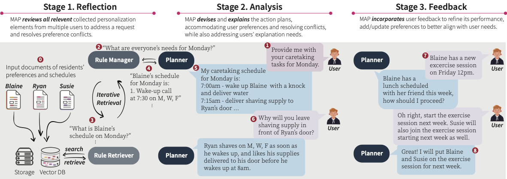

# MAP: Collaborative LLM Agents for User-centered Multi-user Personalization Workflow

[](https://github.com/jihyechoi77/MAP)
[](https://opensource.org/licenses/MIT)

This is the repository for the paper, "MAP: Multi-user Personalization with
Collaborative LLM-powered Agents" to appear at CHI'25 (Extended Abstract).

## **🤖 What is MAP?**

MAP (<ins>M</ins>ulti-<ins>A</ins>gent system for multi-user
<ins>P</ins>ersonalization) is a framework for the orchestration of Large Language Model (LLM)-powered agents to support the user-centered multi-user personalization workflow.

Our multi-user personalization workflow consists of three stages: (1) reflection, (2) analysis, and (3) feedback as follows:
<p align="center">
    <br>
    
    <br>    
<p>


## **⚙️ Set up environment and install dependencies**
We leverage the awesome [Langroid](https://github.com/langroid/langroid) 
open-source Python library for multi-agent LLM applications.

IMPORTANT: Please ensure you are using Python 3.11+. If you are using poetry,
you may be able to just run `poetry env use 3.11` if you have Python 3.11 available in your system. Here we create an anaconda environment with Python 3.11.0, and install the required packages.

```bash
# Clone this repository 
git clone [this-repository]
cd MAP

# Install dependencies in conda environment:
# This installs langroid with extras, and may take a while.
conda create --prefix rag python=3.11
conda activate rag
pip install "langroid[litellm,hf-embeddings,postgres,mysql]"

# Install chainlit for UI
pip install chainlit 
```

## 🔑 Set up environment variables (API keys, etc)

To use the example scripts with an OpenAI LLM, you need an OpenAI API Key (Microsoft Azure OpenAI key).
In the root of the repo, copy the `.env-template` file to a new file `.env`:
```bash
cp .env-template .env
```
Then insert any necessary key values in the '.env' file.
<details>
<summary><b>Detailed setup instructions for Microsoft Azure OpenAI (click to expand)</b></summary> 

When using Azure OpenAI, additional environment variables are required in the 
`.env` file.
This page [Microsoft Azure OpenAI](https://learn.microsoft.com/en-us/azure/ai-services/openai/chatgpt-quickstart?tabs=command-line&pivots=programming-language-python#environment-variables)
provides more information, and you can set each environment variable as follows:

- `AZURE_OPENAI_API_KEY`, from the value of `API_KEY`
- `AZURE_OPENAI_API_BASE` from the value of `ENDPOINT`, typically looks like `https://your.domain.azure.com`.
- For `AZURE_OPENAI_API_VERSION`, you can use the default value in `.env-template`, and latest version can be found [here](https://learn.microsoft.com/en-us/azure/ai-services/openai/whats-new#azure-openai-chat-completion-general-availability-ga)
- `AZURE_OPENAI_DEPLOYMENT_NAME` is the name of the deployed model, which is defined by the user during the model setup 
- `AZURE_OPENAI_MODEL_NAME` Azure OpenAI allows specific model names when you select the model for your deployment. You need to put precisly the exact model name that was selected. For example, GPT-4 (should be `gpt-4-32k` or `gpt-4`).
- `AZURE_OPENAI_MODEL_VERSION` is required if `AZURE_OPENAI_MODEL_NAME = gpt=4`, which will assist Langroid to determine the cost of the model  
</details>

To test if the environment variables are set up correctly, you can run the following command:
```bash
python _test_azure.py
```

## 👩‍💻 Run the scripts
Now you are ready to play around with our MAP framework! Make sure to run the scripts in the working directory: `MAP/src/`.
* To run the monolithic LLM chat agent without any retrieval augmented generation,
```bash
chainlit run baseline.py
```

* To run MAP for each multli-user personalization scenario,
```bash
chainlit run {scenario}.py
```
In the above command, `{scenario}` can be one of the following: `scenario1_workspace`, `scenario2_assistive`, `scenario3_smarthome`.


## **📎 Reference**

If you find this code/work useful in your own research, please consider citing the following:
```bibtex
TBD

```